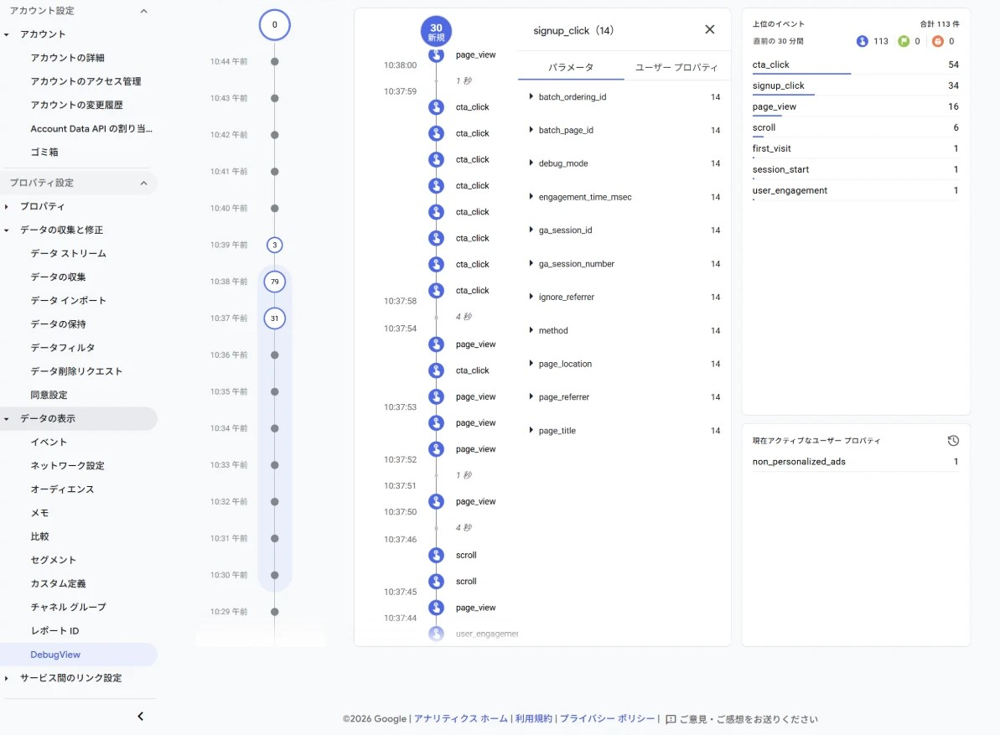

# Laravel + Vite (React / Inertia) + GA4 実装デモ

[](https://laravel.com)
[](https://www.php.net)
[](https://vitejs.dev)
[](https://react.dev)
[](https://inertiajs.com)
[](https://www.docker.com)
[](LICENSE)

Laravel + Vite 上で **Google Analytics 4 (GA4)** の計測を **3パターン** で実装した検証用サンプルです。「Blade 主体 / 管理画面分離 / Inertia SPA」で実装がどう変わるかを、1つのアプリで並べて確認できます。

> GA4 の実装は突き詰めると「**gtag タグをどのレイアウトに置くか**」の一点。中核は [`resources/views/partials/ga4.blade.php`](resources/views/partials/ga4.blade.php) 1ファイルに集約しています。

## 実装パターン

| ルート | パターン | GA4 の挙動 |
|--------|----------|-----------|
| `/` , `/about` | **A: Blade 主体 (MPA)** | 物理ロードごとに `page_view` を自動送信 |
| `/admin` | **B: 管理画面 分離** | GA4 タグを入れない = 計測対象外 |
| `/app` , `/app/page2` | **C: Inertia + React SPA** | 遷移を `router.on('navigate')` で `page_view` を手動送信 |

A・B・C は同一プロジェクト内で共存できます。

## 動作検証 (GA4 DebugView)

`debug_mode` を付けて送っているため、**公開せずローカル (localhost) のまま** GA4 の DebugView でリアルタイムに確認できます。`page_view` や自作イベント (`cta_click` / `signup_click`)、拡張計測の `scroll` などが流れます。



## クイックスタート

```bash
# 1. 測定ID を設定(空のままだと GA4 タグは出力されません)
cp .env.example .env
#   .env の GA4_MEASUREMENT_ID=G-XXXXXXXXXX を記入し、APP_KEY を生成
#   （Docker を使わない場合は composer install && php artisan key:generate）

# 2. 起動
docker compose up --build

# 3. ブラウザで開く
open http://localhost:8000
```

`.env` は Docker にバインドマウントされているため、測定IDを編集してブラウザを再読込するだけで反映されます(再ビルド不要)。

### 検証手順

- **GA4 → 管理 → DebugView** を開いた状態で各ルートを操作
  - `/` `/app` … `page_view` が届く / `/admin` … 何も届かない
  - `/app` ↔ `/app/page2` … SPA でもリロードなしで `page_view` が増える
- **DevTools → Network** で `google-analytics.com/g/collect` を検索しても確認可能

## 仕組み

`vite.config.js` の `input[]` に全エントリを列挙し、各 Blade は `@vite()` で必要なものだけ呼びます (`input` = 作れるエントリの一覧 / `@vite()` = その画面で使う選択)。GA4 の初期化は partial に一元化し、include 時の引数で挙動を切り替えます。

```blade
@include('partials.ga4')               {{-- MPA: 自動 page_view --}}
@include('partials.ga4', ['spa' => true]) {{-- SPA: 自動送信OFF + 手動送信 --}}
```

## 主なファイル

```
vite.config.js                          … input[] に3エントリ
config/services.php                     … ga4.id を env から
resources/views/partials/ga4.blade.php  … GA4タグの一元管理(中核)
resources/views/layouts/user.blade.php  … GA4 あり(ユーザ面)
resources/views/layouts/admin.blade.php … GA4 なし(管理画面)
resources/views/app.blade.php           … Inertia ルート(spa=true)
resources/js/app.jsx                    … router.on('navigate') で手動 page_view
```

## 技術スタック

Laravel 13 / PHP 8.4 / Vite 8 / Tailwind CSS 4 / React 19 / Inertia.js 2 / Alpine.js 3 / Docker

## License

[MIT](LICENSE)
